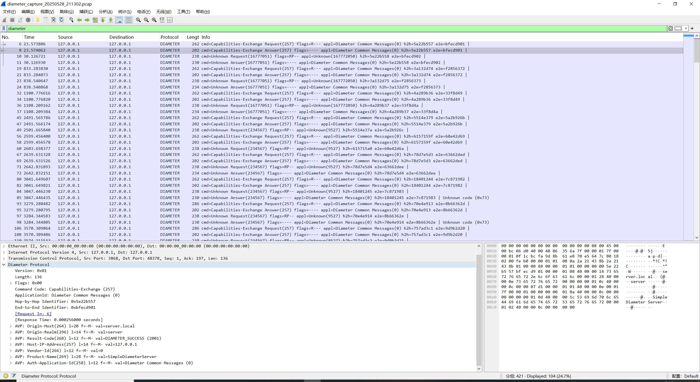
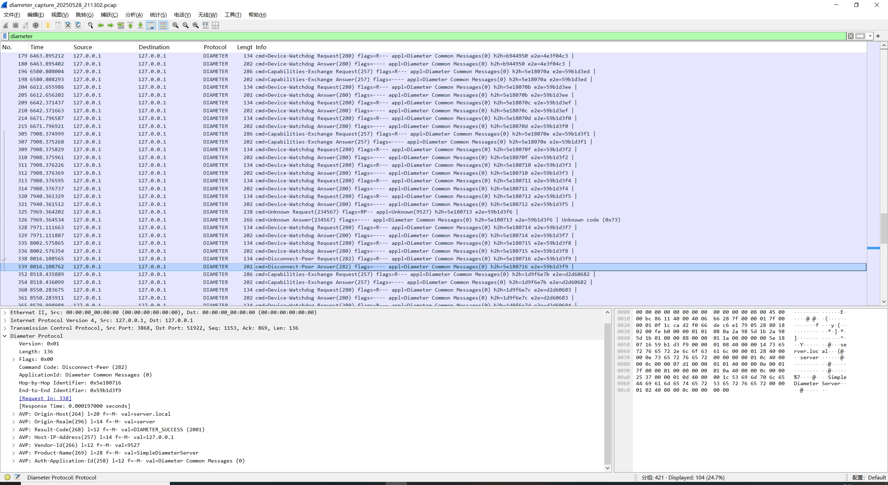
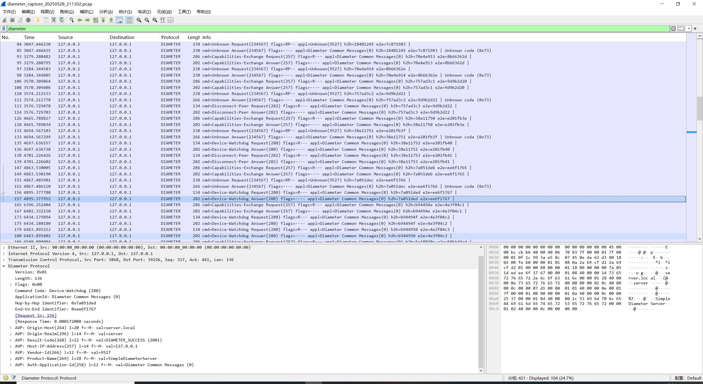
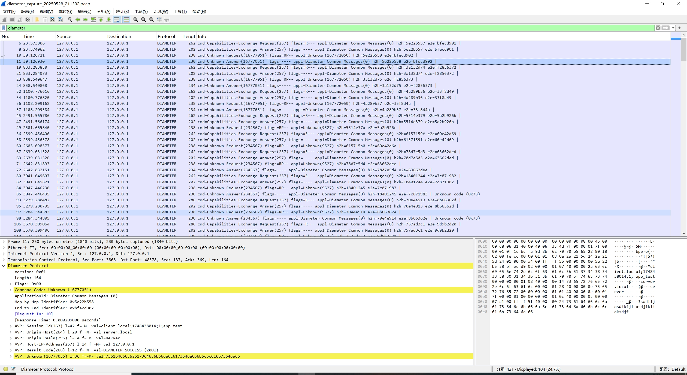
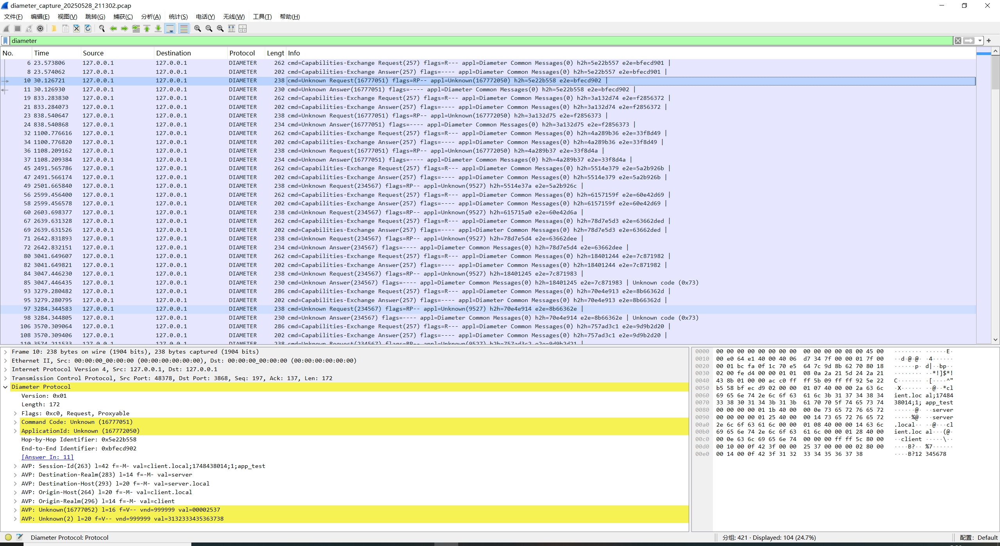

# diameter服务器模拟

## 功能介绍
模拟diameter服务器，实现CER，DWR，DPR等请求的处理，自定义TESTR用于模拟认证,AVP缺失、认证失败等情况会返回错误码与原因。
客户端使用freeDiameter，使用test_app插件模拟发送认证请求,修改了test_app插件代码，里面写死了username和password。没找到能模拟二阶段挑战认证的插件，先用test_app改改。
客户端和服务端都是启动在本地，端口不同。

## 代码结构简介
```plaintext

├── README.md
├── TMPFILE          临时文件，开发的时候记录用到的命令
├── config.json      存储服务器配置，修改密码等字段可用于测试错误返回
├── diameter         源码目录
│   ├── avp.go       Avp读写构造
│   ├── diameter.go  Diameter读写构造
│   ├── server.go    处理socket，读写网络数据
├── diameter_server  编译后可执行文件
├── dict.json        自定义diameter字典
├── fd-client2.conf  客户端freeDiameter配置文件
├── go.mod
├── logs             存储日志和wireshark抓包文件
│   ├── diameter_capture.pcap
├── main.go
└── test_app.conf    freeDiameter扩展test_app的配置文件

```
## 使用方法
1. 编译freeDiameter客户端(可跳过，我连build目录一起上传了)
```
 cd freeDiameter/build/
 rm -rf *
 cmake ..
 make
```
2. 编译运行diameter模拟server
```
直接vscode打开运行，或者在项目目录
go build -o diameter_server
./diameter_server
```
3. 启动运行客户端
```
下面这一步freeDiameter启动后会自动发送CER和DWR，ctrl+c退出的话会发送DPR优雅退出
./freeDiameter/build/freeDiameterd/freeDiameterd -c fd-client2.conf -dd

客户端运行期间不会主动发送模拟认证请求，需要手动触发，执行下面指令触发
pgrep freeDiameterd | xargs sudo kill -SIGUSR1

如果需要验证错误返回，可以修改config.json中的userid_2_password，这样认证就不用过了。

客户端会有error日志，哪个不是消息有问题，而是test_app里面没有注册认证响应消息的回调，可以忽略。
```


## 测试记录
### nmap扫描
```
(base) ayyyyya@DESKTOP-MGQK831:~/codes/diameter$ nmap -sT -p 3868 127.0.0.1
Starting Nmap 7.94SVN ( https://nmap.org ) at 2025-05-28 22:17 CST
Nmap scan report for localhost (127.0.0.1)
Host is up (0.00030s latency).

PORT     STATE SERVICE
3868/tcp open  diameter

Nmap done: 1 IP address (1 host up) scanned in 0.03 seconds
```
### CER请求与响应
```
 [Diameter] 2025/05/29 00:34:58 Listening on port 3868...
 [Diameter] 2025/05/29 00:35:13 Accepted connection from 127.0.0.1:59026
 [Diameter] 2025/05/29 00:35:13 handleDiameter req:
 Version: 1  Length: 220  Flags: 128  Command: CER(257)  ApplicationId: 0  Hop-by-Hop: 1235793301  End-to-End: 3021210052  
AVP: Origin-Host(264)  AVP-Flags: 64  AVP-Length: 20  AVP-Value: client.local
AVP: Origin-Realm(296)  AVP-Flags: 64  AVP-Length: 14  AVP-Value: client
AVP: Origin-State-Id(278)  AVP-Flags: 64  AVP-Length: 12  AVP-Value: 1748450113
AVP: Host-IP-Address(257)  AVP-Flags: 64  AVP-Length: 14  AVP-Value: 172.18.161.120
AVP: Vendor-Id(266)  AVP-Flags: 64  AVP-Length: 12  AVP-Value: 0
AVP: Product-Name(269)  AVP-Flags: 0  AVP-Length: 20  AVP-Value: freeDiameter
AVP: Firmware-Revision(267)  AVP-Flags: 0  AVP-Length: 12  AVP-Value: 10600
AVP: Proxy-Info(299)  AVP-Flags: 64  AVP-Length: 12  
AVP: Vendor-Specific-Application-Id(260)  AVP-Flags: 64  AVP-Length: 32  
AVP: Auth-Application-Id(258)  AVP-Flags: 64  AVP-Length: 12  AVP-Value: 4294967295
AVP: Supported-Vendor-Id(265)  AVP-Flags: 64  AVP-Length: 12  AVP-Value: 5535
AVP: Supported-Vendor-Id(265)  AVP-Flags: 64  AVP-Length: 12  AVP-Value: 9527
AVP: Supported-Vendor-Id(265)  AVP-Flags: 64  AVP-Length: 12  AVP-Value: 10415


 [Diameter] 2025/05/29 00:35:13 handleDiameter rsp:
 Version: 1  Length: 136  Flags: 0  Command: CER(257)  ApplicationId: 0  Hop-by-Hop: 1235793301  End-to-End: 3021210052  
AVP: Origin-Host(264)  AVP-Flags: 64  AVP-Length: 20  AVP-Value: server.local
AVP: Origin-Realm(296)  AVP-Flags: 64  AVP-Length: 14  AVP-Value: server
AVP: Result-Code(268)  AVP-Flags: 64  AVP-Length: 12  AVP-Value: 2001
AVP: Host-IP-Address(257)  AVP-Flags: 64  AVP-Length: 14  AVP-Value: 127.0.0.1
AVP: Vendor-Id(266)  AVP-Flags: 64  AVP-Length: 12  AVP-Value: 9527
AVP: Product-Name(269)  AVP-Flags: 64  AVP-Length: 28  AVP-Value: SimpleDiameterServer
AVP: Auth-Application-Id(258)  AVP-Flags: 64  AVP-Length: 12  AVP-Value: 0
```

### DWR请求与响应
```

 [Diameter] 2025/05/29 00:37:31 handleDiameter req:
 Version: 1  Length: 68  Flags: 128  Command: DWR(280)  ApplicationId: 0  Hop-by-Hop: 562748755  End-to-End: 3133126230  
AVP: Origin-Host(264)  AVP-Flags: 64  AVP-Length: 20  AVP-Value: client.local
AVP: Origin-Realm(296)  AVP-Flags: 64  AVP-Length: 14  AVP-Value: client
AVP: Origin-State-Id(278)  AVP-Flags: 64  AVP-Length: 12  AVP-Value: 1748450219


 [Diameter] 2025/05/29 00:37:31 handleDiameter rsp:
 Version: 1  Length: 136  Flags: 0  Command: DWR(280)  ApplicationId: 0  Hop-by-Hop: 562748755  End-to-End: 3133126230  
AVP: Origin-Host(264)  AVP-Flags: 64  AVP-Length: 20  AVP-Value: server.local
AVP: Origin-Realm(296)  AVP-Flags: 64  AVP-Length: 14  AVP-Value: server
AVP: Result-Code(268)  AVP-Flags: 64  AVP-Length: 12  AVP-Value: 2001
AVP: Host-IP-Address(257)  AVP-Flags: 64  AVP-Length: 14  AVP-Value: 127.0.0.1
AVP: Vendor-Id(266)  AVP-Flags: 64  AVP-Length: 12  AVP-Value: 9527
AVP: Product-Name(269)  AVP-Flags: 64  AVP-Length: 28  AVP-Value: SimpleDiameterServer
AVP: Auth-Application-Id(258)  AVP-Flags: 64  AVP-Length: 12  AVP-Value: 0

```

### DPR请求与响应
```


 [Diameter] 2025/05/29 00:38:04 handleDiameter req:
 Version: 1  Length: 68  Flags: 128  Command: DPR(282)  ApplicationId: 0  Hop-by-Hop: 562748757  End-to-End: 3133126232  
AVP: Origin-Host(264)  AVP-Flags: 64  AVP-Length: 20  AVP-Value: client.local
AVP: Origin-Realm(296)  AVP-Flags: 64  AVP-Length: 14  AVP-Value: client
AVP: Origin-State-Id(273)  AVP-Flags: 64  AVP-Length: 12  AVP-Value: 0


 [Diameter] 2025/05/29 00:38:04 handleDiameter rsp:
 Version: 1  Length: 136  Flags: 0  Command: DPR(282)  ApplicationId: 0  Hop-by-Hop: 562748757  End-to-End: 3133126232  
AVP: Origin-Host(264)  AVP-Flags: 64  AVP-Length: 20  AVP-Value: server.local
AVP: Origin-Realm(296)  AVP-Flags: 64  AVP-Length: 14  AVP-Value: server
AVP: Result-Code(268)  AVP-Flags: 64  AVP-Length: 12  AVP-Value: 2001
AVP: Host-IP-Address(257)  AVP-Flags: 64  AVP-Length: 14  AVP-Value: 127.0.0.1
AVP: Vendor-Id(266)  AVP-Flags: 64  AVP-Length: 12  AVP-Value: 9527
AVP: Product-Name(269)  AVP-Flags: 64  AVP-Length: 28  AVP-Value: SimpleDiameterServer
AVP: Auth-Application-Id(258)  AVP-Flags: 64  AVP-Length: 12  AVP-Value: 0
```

### TESTR请求与响应（成功情况）
```


 [Diameter] 2025/05/29 00:35:21 handleDiameter req:
 Version: 1  Length: 172  Flags: 192  Command: TESTR(234567)  ApplicationId: 9527  Hop-by-Hop: 1235793302  End-to-End: 3021210053  
AVP: Session-Id(263)  AVP-Flags: 64  AVP-Length: 42  AVP-Value: client.local;1748450113;1;app_test
AVP: (283)  AVP-Flags: 64  AVP-Length: 14  
AVP: (293)  AVP-Flags: 64  AVP-Length: 20  
AVP: Origin-Host(264)  AVP-Flags: 64  AVP-Length: 20  AVP-Value: client.local
AVP: Origin-Realm(296)  AVP-Flags: 64  AVP-Length: 14  AVP-Value: client
AVP: Test-AVP(1)  AVP-Flags: 128  AVP-Length: 16  AVP-Value: 9527
AVP: Test-Payload-AVP(2)  AVP-Flags: 128  AVP-Length: 20  


 [Diameter] 2025/05/29 00:35:21 handleDiameter rsp:
 Version: 1  Length: 200  Flags: 0  Command: TESTR(234567)  ApplicationId: 9527  Hop-by-Hop: 1235793302  End-to-End: 3021210053  
AVP: Session-Id(263)  AVP-Flags: 64  AVP-Length: 42  AVP-Value: client.local;1748450113;1;app_test
AVP: Origin-Host(264)  AVP-Flags: 64  AVP-Length: 20  AVP-Value: server.local
AVP: Origin-Realm(296)  AVP-Flags: 64  AVP-Length: 14  AVP-Value: server
AVP: Host-IP-Address(257)  AVP-Flags: 64  AVP-Length: 14  AVP-Value: 127.0.0.1
AVP: Test-AVP(1)  AVP-Flags: 128  AVP-Length: 16  AVP-Value: 9527
AVP: Test-Payload-AVP(2)  AVP-Flags: 128  AVP-Length: 20  
AVP: Result-Code(268)  AVP-Flags: 64  AVP-Length: 12  AVP-Value: 2001
AVP: EAP-Payload(462)  AVP-Flags: 64  AVP-Length: 36  

```

### TESTR请求与响应（失败情况）
```

 [Diameter] 2025/05/29 00:51:28 handleDiameter req:
 Version: 1  Length: 172  Flags: 192  Command: TESTR(234567)  ApplicationId: 9527  Hop-by-Hop: 206326292  End-to-End: 4031211466  
AVP: Session-Id(263)  AVP-Flags: 64  AVP-Length: 42  AVP-Value: client.local;1748451076;2;app_test
AVP: (283)  AVP-Flags: 64  AVP-Length: 14  
AVP: (293)  AVP-Flags: 64  AVP-Length: 20  
AVP: Origin-Host(264)  AVP-Flags: 64  AVP-Length: 20  AVP-Value: client.local
AVP: Origin-Realm(296)  AVP-Flags: 64  AVP-Length: 14  AVP-Value: client
AVP: Test-AVP(1)  AVP-Flags: 128  AVP-Length: 16  AVP-Value: 9527
AVP: Test-Payload-AVP(2)  AVP-Flags: 128  AVP-Length: 20  


 [Diameter] 2025/05/29 00:51:28 handleDiameter rsp:
 Version: 1  Length: 196  Flags: 0  Command: TESTR(234567)  ApplicationId: 9527  Hop-by-Hop: 206326292  End-to-End: 4031211466  
AVP: Session-Id(263)  AVP-Flags: 64  AVP-Length: 42  AVP-Value: client.local;1748451076;2;app_test
AVP: Origin-Host(264)  AVP-Flags: 64  AVP-Length: 20  AVP-Value: server.local
AVP: Origin-Realm(296)  AVP-Flags: 64  AVP-Length: 14  AVP-Value: server
AVP: Host-IP-Address(257)  AVP-Flags: 64  AVP-Length: 14  AVP-Value: 127.0.0.1
AVP: Test-AVP(1)  AVP-Flags: 128  AVP-Length: 16  AVP-Value: 9527
AVP: Test-Payload-AVP(2)  AVP-Flags: 128  AVP-Length: 20  
AVP: Result-Code(268)  AVP-Flags: 64  AVP-Length: 12  AVP-Value: 4001
AVP: Error-Message(281)  AVP-Flags: 64  AVP-Length: 30  AVP-Value: userID or passWD wrong

```









